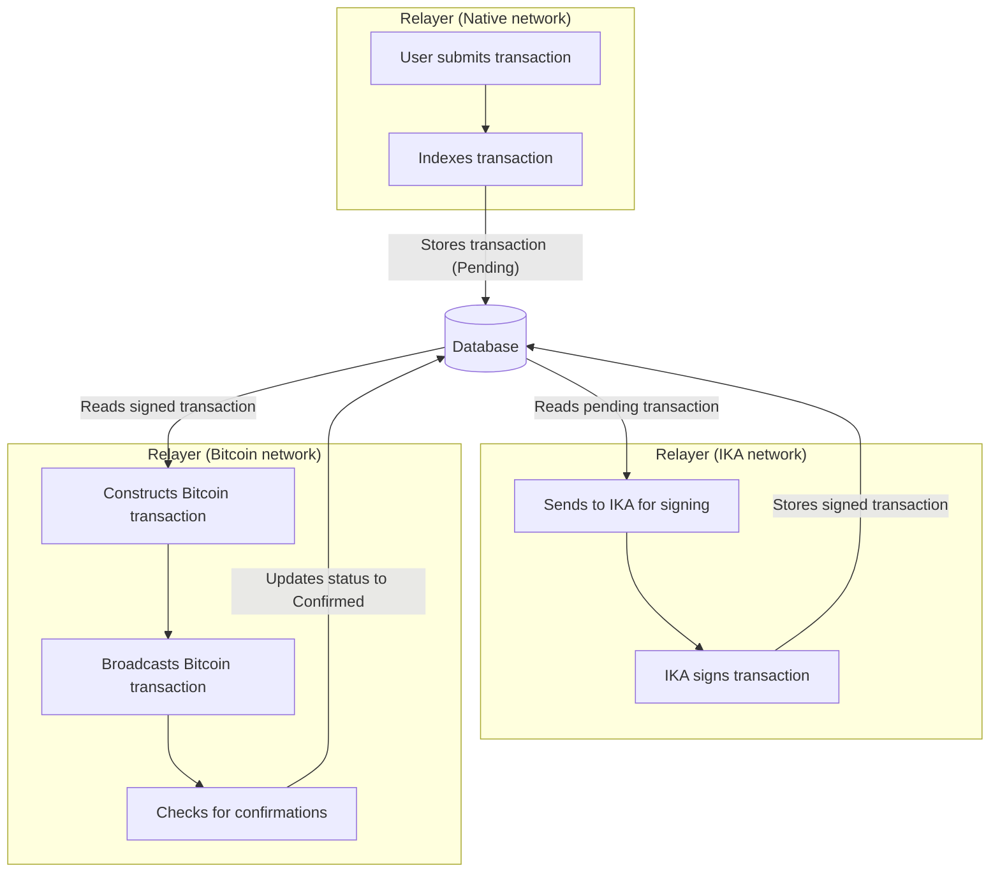

<!-- markdownlint-disable MD041 -->
<!-- markdownlint-disable MD013 -->

<!--  -->

# NATIVE Relayer

[](https://www.repostatus.org/#wip)
[](https://godoc.org/github.com/gonative-cc/relayer)
[](https://goreportcard.com/report/github.com/gonative-cc/relayer)
[](https://github.com/gonative-cc/relayer)
[](https://github.com/gonative-cc/relayer/blob/main/LICENSE)
[](https://github.com/gonative-cc/contributig/blob/master/CODE_OF_CONDUCT.md)

## Summary

A software that monitors and relayers:

- CometBFT blocks to update Native -> Ika light client
- Bitcoin blocks to update Bitcoin -> Native light client
- Bitcoin SPV proofs to verify dWallet holdings
- Native -> Bitcoin transaction relayer

### Status

Status scheme:

```text
Mock -> WIP -> alpha -> beta -> production
```

| Service          | status |
| :--------------- | :----- |
| Native-\>Ika     | WIP    |
| Native-\>Bitcoin | WIP    |
| Native-\>Bitcoin | :x:    |
| Bitcoin SPV      |        |

## Database Interactions

This part describes the database schema and interactions used in the relayer.

### Schema

The relayer uses a SQLite database to store and manage transaction data. The database has a single table named `transactions` with the following schema:

| Column | Data Type | Description |
|---|---|---|
| `btc_tx_id` | INTEGER | The ID of the Bitcoin transaction (primary key) |
| `raw_tx` | BLOB | The raw transaction data as a byte array |
| `tx_hash` | BLOB | The transaction hash as a byte array |
| `status` | INTEGER | The status of the transaction (0: Pending, 1: Signed, 2: Broadcasted, 3: Confirmed) |

### Functions

The relayer interacts with the database using the following functions:

1. `InsertTx()`: Inserts a new transaction into the database.
2. `GetTx()`: Retrieves a transaction by its ID.
3. `GetPendingTxs()`: Retrieves all transactions with a "Pending" status.
4. `UpdateTxStatus()`: Updates the status of a transaction.

### Flow

The following diagram illustrates the flow of a transaction through the relayer and the database. This is one `Relayer` but it interacts with three different networks (`Native`, `IKA` and `Bitcoin`)



## Contributing

Participating in open source is often a highly collaborative experience. We’re encouraged to create in public view, and we’re incentivized to welcome contributions of all kinds from people around the world.

Check out [contributing repo](https://github.com/gonative-cc/contributig) for our guidelines & policies for how to contribute. Note: we require DCO! Thank you to all those who have contributed!

### Security

Check out [SECURITY.md](./SECURITY.md) for security concerns.

## Setup

1. Make sure you have `go`, `make` installed
2. Copy and update your env file: `cp .env.example .env`
3. Build the project: `make build`

To build and start you can run: `make build start`

In order to run Native -> Bitcoin relayer PoC:

1. Copy and update .env.example file to .env `cp env.example .env`
2. Run script with path of transaction file as command line argument: `go run main.go transaction.txt`

### Development

1. Run `make setup` (will setup git hooks)
2. Install and make sure it is in your PATH:

   - [markdownlint-cli2](https://github.com/DavidAnson/markdownlint-cli2)
   - [revive](https://github.com/mgechev/revive)

### Coding notes

1. Use `env.Init()` to setup logger and load ENV variables.
1. Use `zerolog.log` logger, eg:

   ```go
   import "github.com/rs/zerolog/log"
   //...
   log.Info().Int("block", minimumBlockHeight).Msg("Start relaying msgs")
   ```

## Talk to us

- Follow the Native team's activities on the [Native X/Twitter account](https://x.com/NativeNetwork).
- Join the conversation on [Native Discord](https://discord.gg/gonative).
