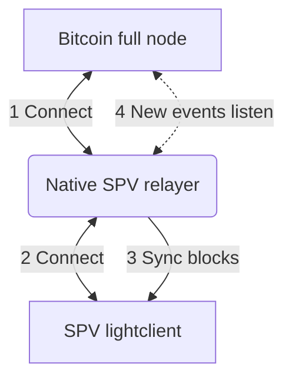
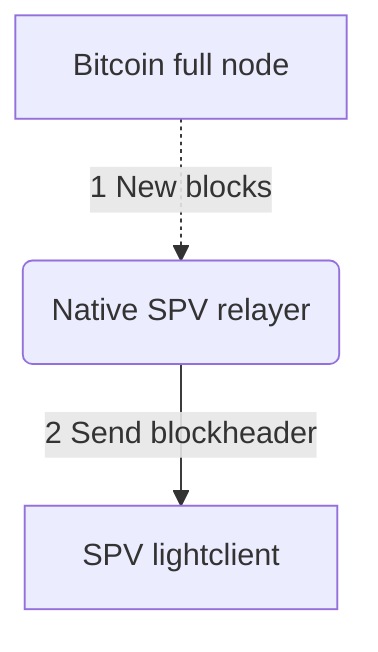
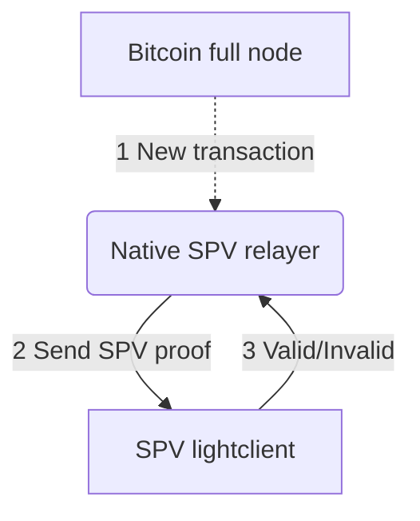

# Bitcoin-SPV

This relayer is responsible for syncing the latest BTC blocks with a BTC node.

- [Configuration](./configuration.md)

## Setup

### Dependencies

- Docker, or [Docker Desktop](https://www.docker.com/products/docker-desktop) for an easy UX
- [Go language](https://golang.org/dl/)

### Run bitcoind node and bitcoin-lightclient

- Setup the docker containers for `bitcoind` node and `bitcoin-lightclient`, refer to [../contrib/bitcoin-mock.md](../contrib/bitcoin-mock.md) for instructions.

## Usage

### Make sure bitcoind is working

Query blockchain info:

```bash
bitcoin-cli -regtest -rpcuser=user -rpcpassword=password getblockchaininfo
```

### Make sure bitcoin-lightclient is working

Ping lightclient RPC:

```bash
curl --user user:password --data-binary '{"jsonrpc":"1.0","id":"curltest","method":"ping","params":[]}' -H 'content-type: text/plain;' http://127.0.0.1:9797
```

### Start the relayer

- Build the `bitcoin-spv` binary:

    ```bash
    go build ./cmd/bitcoin-spv
    ```

- Start the relayer:

    ```bash
    ./bitcoin-spv start --config ./sample-bitcoin-spv.yml
    ```

## Relayer Flow

Following diagram explains how the bitcoin-SPV relayer interacts with `BitcoinNode` and `LightClient` and how data flows from Bitcoin node to Lightclient through the SPV relayer.

### Connecting



### Sending block headers



### Sending SPV proofs


