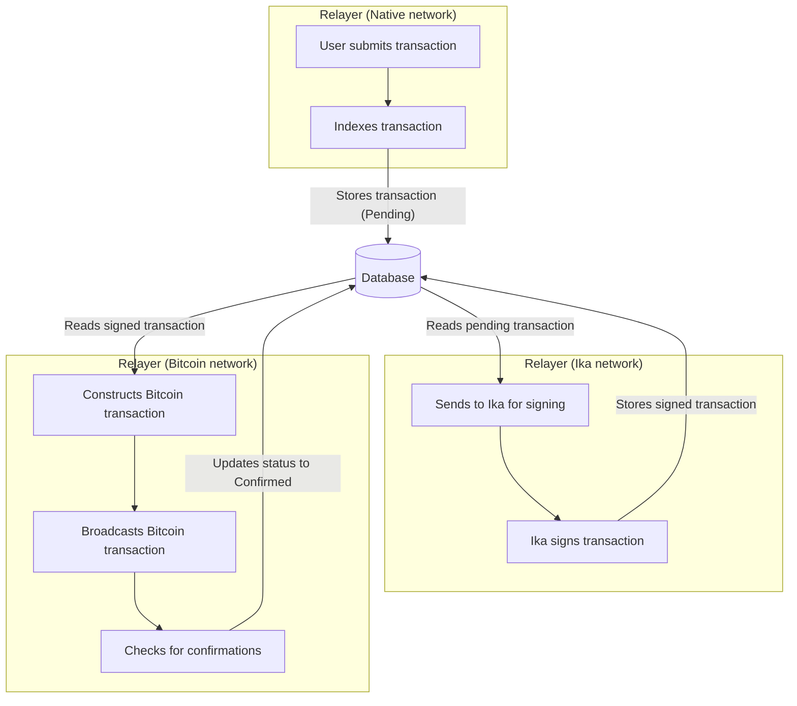

# Flow

The following diagram illustrates the flow of a transaction through the relayer and the database. This is one `Relayer`, but it interacts with three different networks (`Native`, `Ika` and `Bitcoin`)

