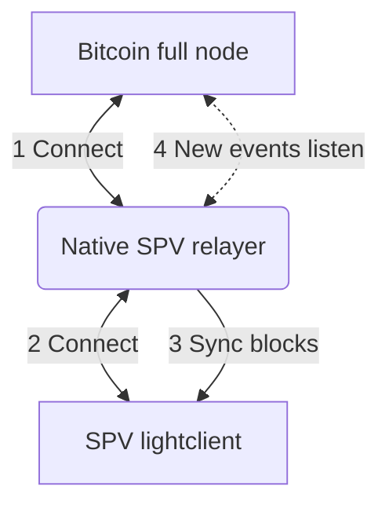
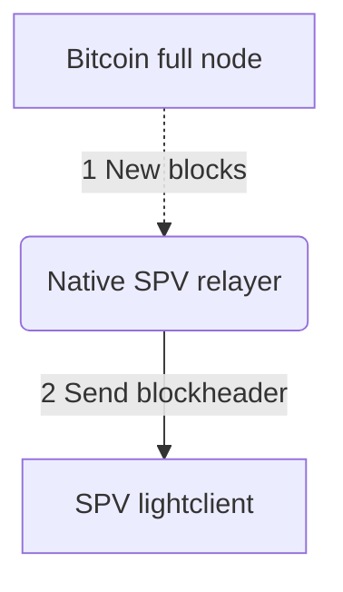
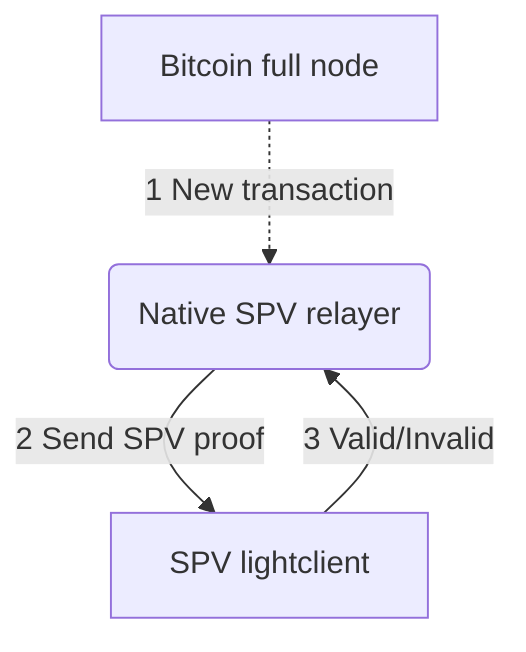

# Bitcoin-SPV Flow

Following diagram explains how the bitcoin-SPV relayer interacts with `BitcoinNode` and `LightClient` and how data flows from Bitcoin node to Lightclient through the SPV relayer.

## Connecting

## Sending block headers

## Sending SPV proofs

