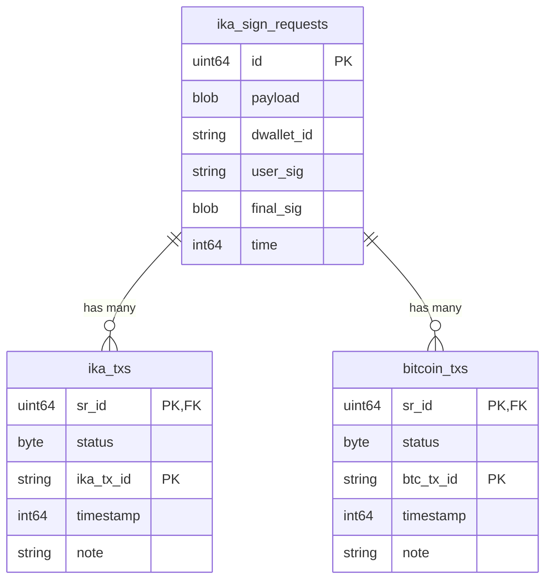

# Schema

```mermaid
erDiagram
    ika_sign_requests {
        uint64 id PK 
        blob payload 
        string dwallet_id 
        string user_sig 
        blob final_sig 
        int64 time 
    }
    ika_txs {
        uint64 sr_id PK, FK 
        byte status 
        string ika_tx_id PK 
        int64 timestamp 
        string note 
    }
    bitcoin_txs {
        uint64 sr_id PK, FK 
        byte status 
        string btc_tx_id PK 
        int64 timestamp
        string note 
    }

    ika_sign_requests ||--o{ ika_txs : "has many"
    ika_sign_requests ||--o{ bitcoin_txs : "has many"
```
