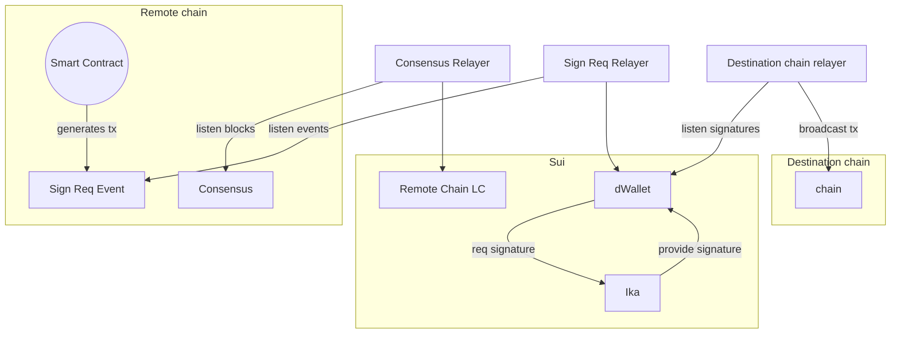

# Sending Sign requests to Ika

This package provides a way to use our relayer to send sign requests to Ika from remote chains.

## STATUS

Proof of Concept ⚠️

## About Ika

Ika is an MPC network, that can sign any bytes / messages. MPC wallets are called dWallets. Ika operates through Sui: all dWallets are registered on Sui and every operations has to go through Sui.

This is how it works:

- User creates a Sui tx to issue a sign request, with a message to sign, on dWallet object.
- Ika listens on dWallet sign requests.
- Ika returns the signature to the dWallet object.
- User can use that signature to broadcast a transaction.
- Ika runs MPC to sign a transaction gonative signed_btc_tx -> bitcoin

```text
 /-- user --\
Sign req -> Sui -> Sui dWallet event

       /------------- IKA ---------------\  /-- user --\
Sui dWallet event -> ika -> signature -> Sui -> do something with signature
```

## Using Ika from remote chains

We can use dWallet to sign transactions for any chain. To do that, we need to create a sign request through the dWallet on Sui with message that we want to sign.

In order to operate dWallet from a remote chain (not a Sui chain) we need to setup few processes:

- On Sui, we need to prove the Remote Chain, to verify remote sign requests. This requires a relayer to send consensus updates with proofs.
- On Remote Chain we need to register remote sign requests. Then we need a relayer that will send the remote sign requests to Sui dWallet, combined with state proofs of that sign requests.
- Ika handles the sign requests on Sui and generates response.
- Finally, we need a relayer for a destination chain, that will listen on signed txs from Ika on Sui, and broadcast them to the destination chain.


